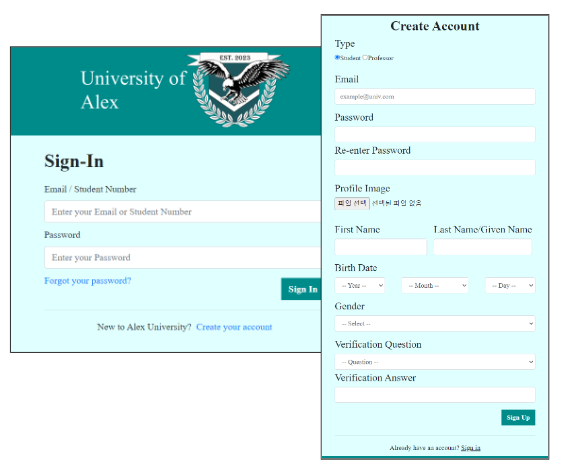
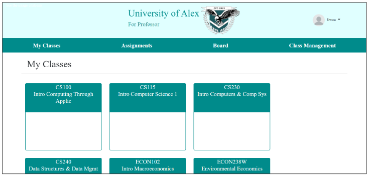
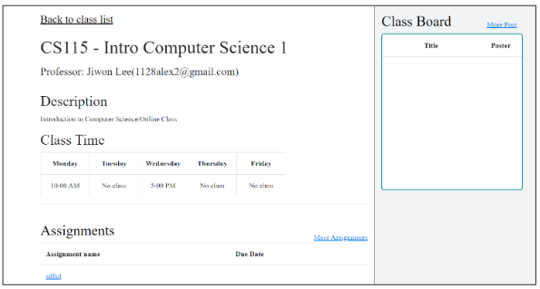
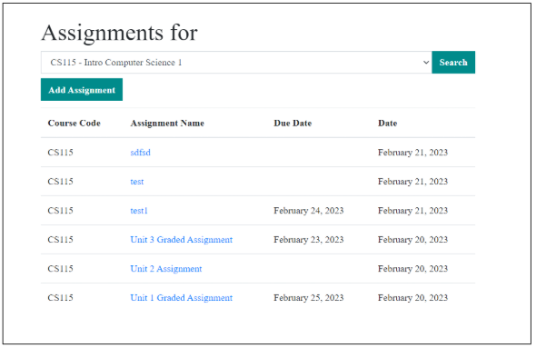
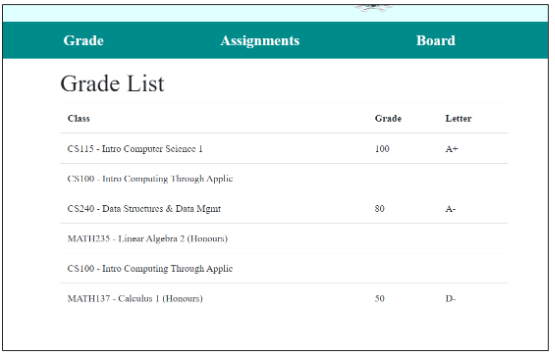
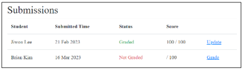
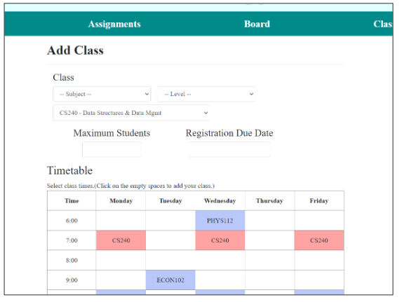
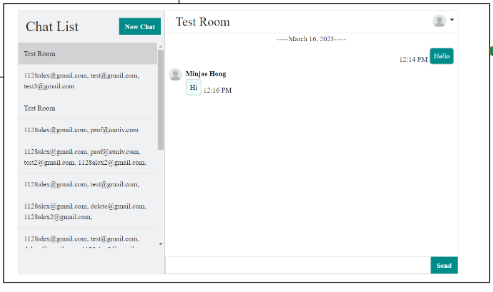

# Academic Management System (Spring Boot + MyBatis + JSP)

A full‑stack university management web app: authentication, course registry, assignments, forum board, real‑time chat, email notifications, and profile uploads. Built with Spring Boot 2.7, Java 17, MyBatis, JSP/JSTL, and MySQL.

- Live Demo: http://3.39.193.52:8080/univ/user/sign_in (currently closed)
- Repository: https://github.com/1128alex/academic_management_system
- Slides: https://docs.google.com/presentation/d/1kUDCUyPxO7l87JH-BbeBmj2nD8tYRrdA/edit?slide=id.p1#slide=id.p1

## ✨ Features
- Session-based authentication with role handling (student/professor/admin) and login guard via interceptor
- Course management and registry (enroll/drop), assignment create/list/detail, and forum-style board
- Real-time chat
- File uploads (profiles, attachments) with static image serving
- JSP + JSTL views with shared templates and CSS assets

## 🛠️ Tech Stack
- Java 17, Spring Boot 2.7.x
- MyBatis (XML mappers)
- JSP + JSTL with embedded Tomcat (Jasper)
- MySQL 8.x
- Spring WebSocket
- Gradle (Wrapper included)

## 🖼️ Snapshots
<p align="center">
	
  
</p>
<p align="center">
	
</p>
<p align="center">
	
	
</p>
<p align="center">
	
	
</p>
<p align="center">
	
</p>
<p align="center">
	
</p>

## 📁 Project Structure (key parts)
```
src/
	main/
		java/com/univ/
			UnivWebApplication.java
			config/
				DatabaseConfig.java
				WebMvcConfig.java
			interceptor/
				PermissionInterceptor.java
			common/
				FileManagerService.java
				EncryptUtils.java
			user/
			course/
			assignment/
			board/
			chat/
			registry/
			mail/
		resources/
			application.yml
			mappers/*.xml
			static/
				css/, img/, db_query/
		webapp/WEB-INF/jsp/
```

## 🚀 Getting Started (Local)

1) Requirements
- Java 17, MySQL 8.x
- PowerShell (Windows) or any shell; Gradle Wrapper is included

2) Database setup (local)
- Create a database (default in `application.yml`): `univ_web_schema`
- Run SQL from `src/main/resources/static/db_query/` in order:
	- `Table_Create.sql`
 
3) Configure application
- Edit `src/main/resources/application.yml`:
	- `spring.datasource.url`, `username`, `password`
- If using email, set credentials (add):
	- `spring.mail.username`, `spring.mail.password`

4) Configure file uploads
- Update `FileManagerService.FILE_UPLOAD_PATH` to a valid folder on your machine and ensure the directory exists.

5) Run the app
```powershell
.\gradlew.bat bootRun
```
- Open http://localhost/univ/user/sign_in (port 80) or http://localhost:8080/univ/user/sign_in if you changed the port.

Test accounts
- Student: student@auniv.com / 1111
- Professor: professor@auniv.com / 1111

## 🧱 Build
```powershell
.\gradlew.bat build
```
Outputs the bootable JAR to `build\libs\UnivWeb-0.0.1-SNAPSHOT.jar`.

## 🌐 Deploy
- Bootable JAR (example):
	```powershell
	java -jar build\libs\UnivWeb-0.0.1-SNAPSHOT.jar
	```
- Configure `server.port` and production datasource/mail settings via `application.yml` or environment variables.
- Ensure the upload path (`FileManagerService`) exists on the server and is writable.

## 📄 License
Please credit the author when you use parts of this repository.
